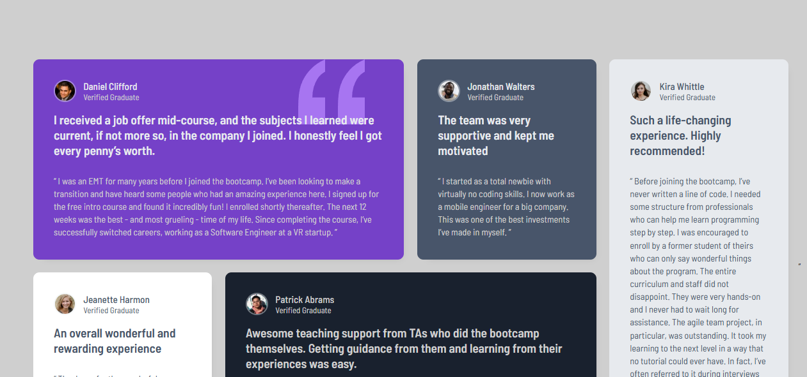

# Frontend Mentor - Testimonials grid section solution
## Table of contents

  - [The challenge](#the-challenge)
  - [Screenshot](#screenshot)
  - [Links](#links)
- [My process](#my-process)
  - [Built with](#built-with)
  - [What I learned](#what-i-learned)
  - [Continued development](#continued-development)
  - [Useful resources](#useful-resources)

## Overview

### The challenge

Users should be able to:

- View the optimal layout for the site depending on their device's screen size

### Screenshot

### Links

- Solution URL: [Access to Repo](https://github.com/David-VB03/Testimonials_section)
- Live Site URL: [Live the site](https://your-live-site-url.com)

## My process>

### Built with

- Semantic HTML5 markup
- CSS custom properties
- Flexbox
- CSS Grid
- Mobile-first workflow

### What I learned

Improve my css skills and how to develop a simple website using modern properties and following best practices for it'd be accesible and understandble.
### Continued development

I continue my formation in web development using softwares and analizing the challenges that I
find on INTERNET , Then I'll add javascript language for website and other libraries like 
bootstrap and tailwind , Also I'll try implement sass or less in my css files.

Finally, I understood that Its easier draw a mockup for a website before developing it , For that reason I have decided to learn Figma for save time and improve my profile.
### Useful resources

The Findings I found it using IA and other tools.

